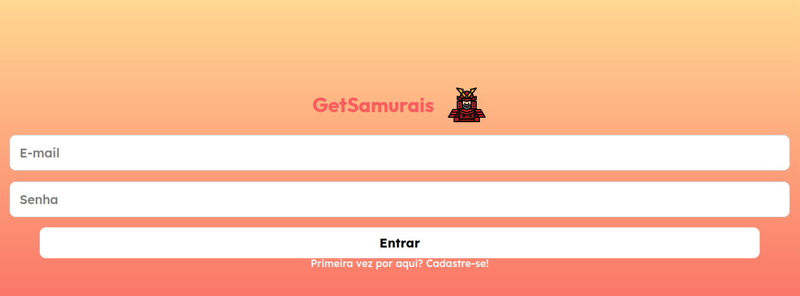

# Get Samurais:

O Get Samurais é uma plataforma com a intenção de conectar pessoas oferecendo serviços e pessoas interessadas nesses serviços, num molde à plataforma GetNinjas.
Este é o repositorio do front-end da aplicação.

# Deploy:

[Link do projeto](https://projeto18-freela-front-sable.vercel.app/)

# Como funciona?

Este projeto é um Front-End SPA para a aplicação Get Samurais:

  

# Tecnologias utilizadas

Para este projeto, foram utilizadas:

- axios: versão 1.4.0
- dayjs: versão 1.11.9
- react: versão 18.2.0
- react-dom: versão 18.2.0
- react-icons: versão 4.8.0
- react-loader-spinner: versão 5.3.4
- react-router-dom: versão 6.9.0
- styled-components: versão 5.3.6

# how to run/Como rodar em desenvolvimento:

Para executar este projeto em desenvolvimento, é necessário seguir os passos abaixo:

- Clonar o repositório;
- Baixar as dependências necessárias com o comando: `npm install`;
- Em seguida, criar o arquivo `.env` com um unico elemento:
  - VITE_API_URL="Url do seu back-end"
    - Caso necessário, consulte o [Repositório Back-End](https://github.com/Vinni088/projeto18-freela-back)
- Para rodar o projeto em desenvolvimento, execute o comando `npm run dev`;
- Testes manuais podem ser feitos através do Thunder Client.